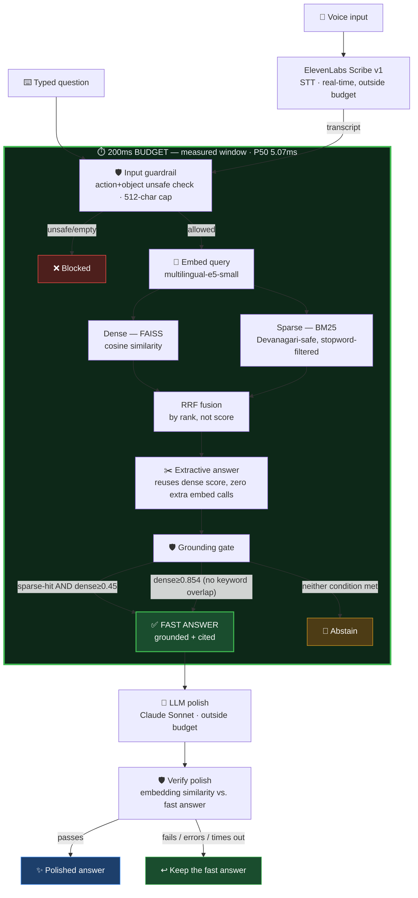

# श्रवण · Voice-Enabled RAG (HH Goa 2026, Task 2)

Speak a question in Hindi → transcribed → retrieved against an indexed corpus → answered only when the evidence supports it. If it doesn't, the system says so instead of guessing.

**Live deployment:** https://rag-model-production-3de3.up.railway.app

---

## Core principle

This isn't a chatbot with a voice interface bolted on. It's a fast search-and-proof engine that happens to accept voice. The strongest signal isn't the answers it gives — it's the answers it correctly refuses to give.

---

## Architecture

Two-tier design: a **measured, sub-200ms fast path** using extractive retrieval only (no LLM call), and an **optional slower path** that layers an LLM polish on top, explicitly outside the latency budget and never trusted blindly.



**Why extractive-first:** an LLM API call cannot fit inside a 200ms budget under any real-world network condition. Rather than fudge the number, the fast path never calls an LLM at all — the answer is a directly-cited span from retrieved text, and its "support score" reuses the dense cosine similarity already computed during retrieval instead of re-embedding anything. Polish is strictly additive: it can only improve phrasing, never replace grounding, and any failure or drift falls back to the original fast answer.

**Why the grounding gate has two conditions:** dense cosine similarity alone doesn't reliably separate relevant from irrelevant content — testing showed genuinely off-topic queries scoring 0.79–0.85, indistinguishable from real matches in that range. Requiring real lexical (BM25) corroboration catches most false positives cheaply; the higher dense-only bypass (0.854) exists specifically for true paraphrases that share no keywords with the source text at all, calibrated against the measured gap between confirmed false positives (max 0.845) and confirmed true positives (0.863+) on this corpus.

---

## Chunking

Four indexed strategies, not one naive fixed-size split:

| Strategy | Approach |
|---|---|
| `fixed` | Fixed word-count windows with overlap — baseline |
| `sentence` | Sentences packed up to a target size, respecting sentence boundaries |
| `semantic` | Topic-boundary detection via embedding-similarity drop between consecutive sentences |
| `contextual` | Chunks wrapped with parent-passage context attached |

Every chunk carries metadata (document ID, parent ID, language, strategy, ground-truth relevance flag where available) rather than being bare text. `sentence` is the strategy served in production — it consistently produced tight, well-supported answers in testing without the overhead of dynamic semantic boundary detection at query time.

---

## Retrieval quality fixes (real bugs found and fixed during testing)

Two specific issues were found empirically, not by inspection, and fixed:

1. **BM25 stopword contamination.** Without filtering, function words (है, का, is, the...) created false "keyword overlap" for genuinely unrelated queries — e.g. a query about a "neighbor's phone number" matched an unrelated passage purely because both shared common grammatical words. Fixed with a bilingual stopword filter plus a minimum real-token-overlap requirement (2+ shared content words, or all of them for short queries).

2. **Dense-only false positives.** Cosine similarity between short embeddings doesn't have a reliable "irrelevant" floor — genuinely off-topic queries scored 0.79–0.85, statistically indistinguishable from real matches in that range. Fixed by requiring either real lexical corroboration (BM25 hit) at a normal threshold, **or** a much higher dense-only bypass threshold (0.854) for genuine no-shared-keyword paraphrases — calibrated against the real measured gap between confirmed false positives (max 0.845) and confirmed true positives (0.863+) on this corpus.

---

## Guardrails

| Guardrail | Mechanism |
|---|---|
| Unsafe input | Action+object phrase matching (e.g. "how to make a bomb"), not standalone nouns — avoids false-blocking legitimate factual mentions of weapons in historical content |
| Off-topic | Grounding gate (above) |
| Invalid input | Empty/whitespace input blocked with a proper structured response |
| Query length | Capped at 512 characters before processing |
| Abstention | Explicit "I don't have enough information in the provided corpus to answer that" — shown as a distinct UI state, not a generic error |

**Verified: 11/11 test cases passing against the live deployment**, covering grounded/easy, semantic paraphrase (no shared keywords), keyword-only, off-topic (future event + personal), nonsense/gibberish, unsafe input (Hindi + English), empty input, whitespace-only input, and malformed/repetitive long input.

---

## Latency — measured, not claimed

Two numbers, reported separately, because they measure different things:

### Server-side pipeline latency (what the <200ms budget is about)
Guardrail → retrieval → fusion → extraction → grounding gate, measured with `time.perf_counter()` inside the running server.

| Metric | Value |
|---|---|
| P50 | 5.07ms |
| P70 | 5.39ms |
| P90 | 6.1ms |
| P100 | 9.98ms |
| **Under 200ms budget** | **49/49** |

Measured against the live production deployment, 49 real queries (1 warmup excluded).

### Network-inclusive round-trip latency (transparency, not budgeted)
Full HTTP request from a client machine to Railway and back, including internet transit and STT where applicable.

| Metric | Value |
|---|---|
| P50 | 1070ms |
| P70 | 1133ms |
| P90 | 1254ms |
| P100 | 1413ms |

This second number is *expected* to be higher — it includes real network transit that has nothing to do with pipeline efficiency. Reporting both, rather than only the flattering one, is deliberate.

### Tier 2 (LLM polish), for reference
Explicitly outside the budget by design. One live-tested example: `polish_ms: 3326ms`, `verify_ms: 21.7ms`, `end_to_end_ms: 3353ms`.

Raw JSON results for every benchmark run are saved under `evaluation/reports/` for reproducibility.

---

## Tech stack

| Component | Choice | Why |
|---|---|---|
| STT | ElevenLabs Scribe v1 | Task-permitted, verified against real SDK signature |
| Embeddings | `intfloat/multilingual-e5-small` | CPU-fast, fits comfortably in constrained deployment RAM — chosen over larger multilingual models specifically for speed |
| Dense index | FAISS `IndexFlatIP` (exact) | At this corpus size, exact search is still fast (see latency above); approximate indexing (HNSW) would only matter at much larger scale |
| Sparse index | `rank_bm25`, custom Devanagari-safe tokenizer | Off-the-shelf `\w` regex mishandles Devanagari combining marks |
| Fusion | Reciprocal Rank Fusion | Rank-based, avoids needing to normalize incompatible dense/sparse score scales |
| Generation (polish only) | Claude Sonnet | Reword-only, explicitly constrained not to introduce new facts |
| Backend | FastAPI | Serves both `/api/*` and the static frontend from one container |
| Deployment | Docker on Railway | 1GB RAM tier — sufficient for this stack; smaller free tiers (512MB) OOM on `torch`/`sentence-transformers` import alone |
| Retries | `tenacity`, on STT and polish calls | Distinguishes transient failures (timeout, 5xx, rate limit) from permanent ones (auth errors) — only retries the former |

---

## Known limitations (stated honestly)

- **Hindi only.** The underlying dataset (`ai4bharat/MSMARCO-XI`) supports 14 languages; this build indexes Hindi only. A scoping decision made for time, not a technical ceiling.
- **Corpus sample.** ~5,000 passages indexed for build speed, out of 199,590 available in the full Hindi split. Retrieval quality is real and tested against this sample; scaling up is straightforward but wasn't necessary to demonstrate the architecture.
- **STT can mishear proper nouns.** Observed live: "मैनहट्टन" (Manhattan, a transliterated foreign term) was misheard as "मेहनत" (a common Hindi word) in one real test. The system correctly abstained on the resulting nonsense query rather than guessing — a real demonstration of the grounding gate working as intended, not a failure.
- **Corpus contains scraped web noise.** Some passages (e.g. weather-widget content) are garbled by nature of the source dataset being open web crawls. The pipeline correctly retrieves and grounds against this content when topically relevant; the noise is a data-quality characteristic, not a pipeline bug.
- **Dense-bypass threshold is corpus-specific.** The 0.854 calibration was measured against this specific corpus and embedding model; a significantly different corpus would need re-calibration using the same empirical method (measure real false-positive ceiling vs. true-positive floor, don't guess).

---

## Repo structure

```
backend/
  api/main.py              FastAPI app, /api/query endpoint
  services/
    guardrails.py          Input validation, unsafe pattern matching
    grounding.py           Dual-condition grounding gate
    harness.py             Orchestrates the full Tier 1 + Tier 2 pipeline
    polish.py              Tier 2 LLM polish + verify
    stt.py                 ElevenLabs speech-to-text, with retries
  config.py                All tunables in one place
  models/schemas.py        Typed request/response contracts

retrieval/
  tokenizer.py             Devanagari-safe, stopword-filtered tokenizer
  hybrid_search.py         Dense + sparse + RRF fusion
  extractive.py            Zero-embedding extractive answer
  build_bm25.py            BM25 index builder

ingestion/                 Dataset download, chunking, embedding, indexing
evaluation/                Guardrail tests, latency benchmarks (local + live)
frontend/                  Static UI served by the FastAPI app
```

---

## Running locally

```bash
cd backend && pip install -r requirements.txt
cp .env.example .env  # add ANTHROPIC_API_KEY, ELEVENLABS_API_KEY

# Build indexes (see ingestion/ scripts in order 00→04)
cd ../retrieval && python build_bm25.py

cd ../backend
uvicorn api.main:app --host 0.0.0.0 --port 8000
```

Then visit `http://localhost:8000`.

## Reproducing the benchmarks

```bash
cd evaluation
python run_guardrail_tests.py          # local guardrail suite
python test_live_guardrails.py <url>   # against a live deployment
python run_live_batch.py <url>         # latency percentiles against a live deployment
```

---

Built for HH Goa 2026, Task 2 — voice-enabled RAG. #RAGInGoa
