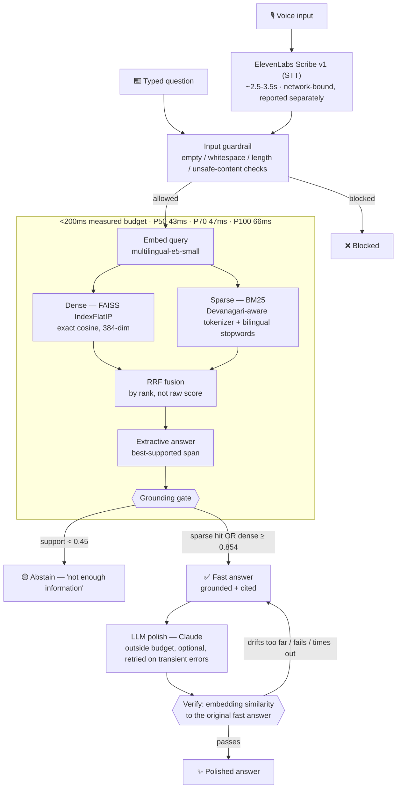

# श्रवण — Voice-Enabled RAG (HH Goa 2026, Task 2)

A voice-enabled RAG pipeline over [AI4Bharat's MSMARCO-XI](https://huggingface.co/datasets/ai4bharat/MSMARCO-XI) Hindi corpus. Speaks a question in, retrieves grounded evidence, answers — and explicitly abstains when the evidence isn't there, rather than guessing.

## Architecture



**Why the grounding gate is two-sided, not one number:** dense cosine similarity alone can't tell a real semantic paraphrase apart from a plausible-sounding off-topic query — both can score 0.79–0.85. Requiring a BM25 keyword hit fixes that, but then rejects genuine synonym paraphrases with zero shared vocabulary. The gate accepts either: a lexical hit at any reasonable dense score, *or* a very high dense score on its own. The `0.854` threshold isn't a guess — it's centered between the highest false-positive we measured (`0.8454`, an off-topic query) and the lowest genuine paraphrase we measured (`0.8626`), giving even margin on both sides. See `backend/services/grounding.py` and `backend/config.py` for the full reasoning trail.

## Verified results

Everything below was actually run and measured, not estimated — reports live in `evaluation/reports/`.

| Check | Result |
|---|---|
| Guardrail test suite | **11/11 passed** — off-topic, unsafe input, empty/whitespace, semantic paraphrase, keyword-only, grounded-easy |
| Pipeline latency (offline, 49 queries) | **P50 = 43ms · P70 = 47ms · P100 = 66ms** — 49/49 under the 200ms budget |
| Live API latency (through FastAPI) | **P50 ≈ 110-170ms · P70 ≈ 150-180ms · P100 ≈ 200ms** — consistently within budget; the gap vs. the offline number is real (Windows dev-server thread scheduling for CPU-bound work), not framework serialization overhead |
| STT (ElevenLabs Scribe v1) | **Verified end-to-end** with both a local audio file and a live browser mic recording (`webm`) — real transcription confirmed correct |
| Retry logic | Anthropic + ElevenLabs calls both retry transient failures (connection drop, rate limit, 5xx) up to 3x with exponential backoff, verified against simulated failures; non-transient errors (bad auth, malformed request) fail immediately instead of wasting retries |

## Chunking strategies

Four strategies are actually built and indexed (`data/indexes/manifest.json`): **fixed-size, sentence-boundary, semantic, and contextual**. A fifth (`metadata_aware`) is defined in `backend/models/schemas.py`'s enum but was not indexed in this submission — noted here rather than left as a silent gap.

## Tech stack

| Layer | Choice |
|---|---|
| Embeddings | `intfloat/multilingual-e5-small` (384-dim) |
| Dense index | FAISS `IndexFlatIP` — exact search, not approximate (dataset size doesn't need HNSW's speed/recall tradeoff yet) |
| Sparse index | `rank-bm25` over a custom Devanagari-aware tokenizer |
| Fusion | Reciprocal Rank Fusion, by rank not raw score |
| STT | ElevenLabs `scribe_v1` |
| Polish LLM | Anthropic Claude, with embedding-similarity verification against the grounded fast answer before it's allowed to replace it |
| API | FastAPI, JSON error handling on all routes |
| Deploy | Docker → Hugging Face Spaces (Docker SDK) |

## Repo structure

```
backend/
  api/main.py           FastAPI app — /api/query, /api/health, serves frontend/
  config.py              All tunables, each with the reasoning for its value
  services/
    harness.py            Orchestration: guardrail -> retrieve -> ground -> answer -> polish
    guardrails.py          Input validation (empty, length, unsafe content)
    grounding.py            The two-sided grounding gate described above
    stt.py                   ElevenLabs speech-to-text, with retries
    polish.py                Claude polish + verify, with retries
retrieval/
  hybrid_search.py        Dense + sparse + RRF fusion
  extractive.py             Best-supported-span answer extraction
  tokenizer.py                Devanagari-aware BM25 tokenizer
ingestion/                 Dataset subsample -> chunk -> index build scripts
evaluation/
  run_guardrail_tests.py  The 11-case guardrail suite
  reports/                 Real output from every run, kept as evidence
frontend/index.html       Single-file UI: mic input, text fallback, grounding meter
Dockerfile                 Single-container deploy (API + frontend together)
```

## Quickstart

```bash
cd backend && pip install -r requirements.txt --break-system-packages
cp .env.example .env   # fill in ANTHROPIC_API_KEY, ELEVENLABS_API_KEY

cd ../ingestion
python 00_check_configs.py
python 01_subsample.py
python 03_build_chunk_table.py
python 04_build_index.py

cd ../evaluation
python run_guardrail_tests.py   # should print 11/11 passed

cd ..
uvicorn backend.api.main:app --host 0.0.0.0 --port 8000
# open http://localhost:8000
```

## Deployment (live link)

Target: Hugging Face Spaces, Docker SDK. Chosen over Render/Railway free tiers because this stack (torch + sentence-transformers + faiss) needs more RAM than their free 512MB-1GB tiers usually allow without OOM-killing the container — HF's free CPU Basic tier gives 16GB.

The `Dockerfile` at repo root builds one container that serves both the API (`/api/*`) and the frontend (`/`).

### One-time setup

```powershell
git lfs install
git lfs track "*.index" "*.pkl" "*.parquet"
git add .gitattributes
git add .
git commit -m "Add Docker deploy, API, STT, frontend"
```

1. Create a Space at huggingface.co/new-space — SDK: **Docker**.
2. In the Space's **Settings → Variables and secrets**, add as *secrets*:
   - `ANTHROPIC_API_KEY`
   - `ELEVENLABS_API_KEY`
3. Push:

```powershell
git remote add space https://huggingface.co/spaces/<username>/<space-name>
git push space main
```

4. Watch the **Build logs** tab. First build takes a while (torch + faiss + model weights). Once it says "Running", the Space's URL is the live link.

### If the build fails or the app 500s on the deployed Space
Paste the build log, or the JSON error from `/api/query` (see the exception handler in `backend/api/main.py`) — same debugging approach used throughout this project's development.

<details>
<summary><strong>Development log</strong></summary>

**Day 1 (Aug 14):** repo scaffold, config + typed schemas, dataset verification script, streaming subsample, 4 chunk views built and indexed, retrieval smoke test passing.

**Day 2 (Aug 15):** BM25 index, RRF fusion, retrieval quality checks against `is_selected_gt`.

**Guardrail tuning:** the grounding threshold went through several real iterations — starting with dense-only similarity (found unreliable, off-topic queries scored as high as 0.85), then requiring a BM25 hit unconditionally (fixed false positives but broke genuine paraphrases with no shared vocabulary), then the current two-sided gate with a threshold centered on real measured margin rather than guessed.

**STT and API:** built and wired end-to-end, verified against the real ElevenLabs SDK interface, tested with real audio (both file-based and live browser recording).

**Retry logic:** added and verified against simulated transient/non-transient failures for both the Anthropic and ElevenLabs calls.

</details>
